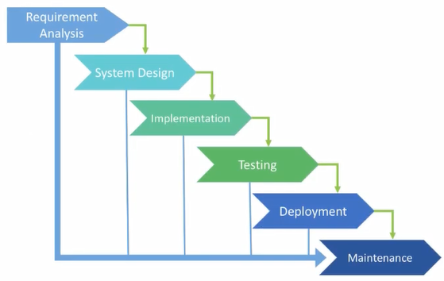
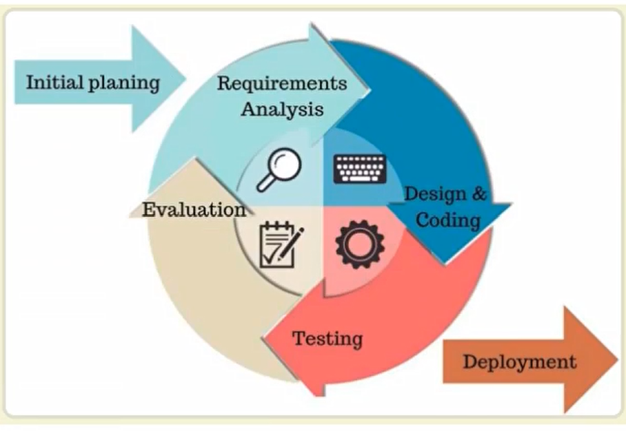
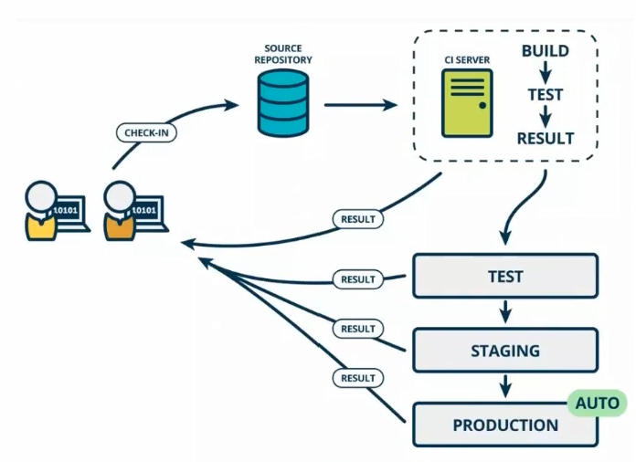
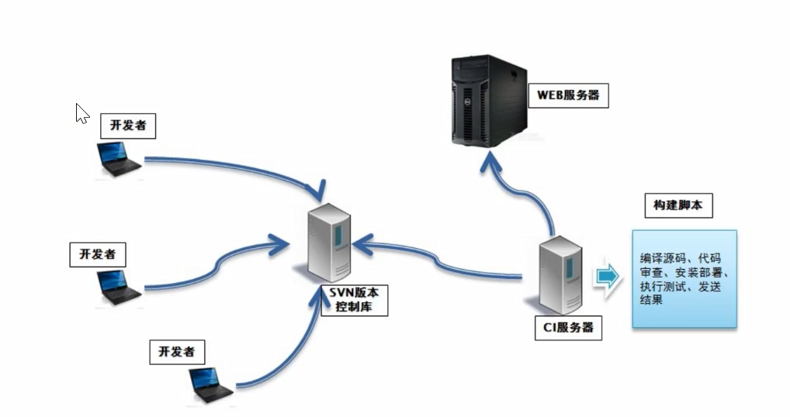

# Jenkins基础

作者：张金龙

日期：2022-01-20


## 1 Jenkins及持续集成

Jenkins是一款流行的开源持续集成工具，具有自动化构建、测试和部署等功能。官网：http://jenkins-ci.org

Jenkins特点：

- 开源的Java开发的持续化集成工具，持续集成（CI/Continuous integration），持续部署（CD/continuous Delivery）
- 安装简单
- 消息通知和测试报告
- 分布式构建
- 文件识别
- 插件丰富

### 1.1 软件开发的生命周期

Software Development Life Circle

| 软件生命周期SDLC             | 说明                                           |
| ---------------------------- | ---------------------------------------------- |
| 需求分析Requirement Analysis | 可行性计划分析                                 |
| 设计Design                   | 系统架构和满意状态，创建一个项目计划           |
| 开发Implementation           | 编写代码并进行源码管理，编译打包提供给测试人员 |
| 测试Testing                  | 功能、代码、压力测试                           |
| 优化Evolution                | Bug修复，功能优化，运维                        |


### 1.2 软件开发模型——瀑布



| 优势                               | 劣势                                           |
| ---------------------------------- | ---------------------------------------------- |
| 简单易用和理解                     | 各个阶段的分化完全固定，阶段之间产生大量的文档 |
| 当前一阶段完成后，只需关注后续阶段 | 开发模型使线性的，增加开发风险                 |
| 为项目提供了按阶段划分的检查节点   | 不能适应用户频繁的需求变化                     |

### 1.3 软件开发模型——敏捷开发

敏捷开发（Agile Dev）的核心是①迭代式开发(Iterative Dev)②增量式开发(Incremental Dev)

#### ==迭代开发==

开发的大周期拆分成小周期，每个小周期有相同的流程，看上去像同样步骤的不断重复

#### ==增量开发==

软件的每个版本，新增一个用户可感知的完整功能。按照新增功能来划分迭代

#### 软件工程方法论



| 优势     | 劣势 |
| -------- | ---- |
| 早期交付 |      |
| 降低风险 |      |

### 1.4 什么是持续集成

持续集成（Conitnuous Integration），简称CI，频繁地将代码集成到主干

**持续集成的目的**   让产品快速迭代的同时保持高质量

**核心措施	**代码集成到主干前，必须通过自动化测试（只要有一个用例失败就不可集成）

通过持续集成，团队可以快速从一个功能到另一个功能，完成敏捷开发


#### 持续集成流程



| 持续集成步骤   | 说明                                     |
| -------------- | ---------------------------------------- |
| 提交           | 提交代码或合并至主干                     |
| 测试（第一轮） | Hook                                     |
| 构建           | 通过第一轮测试则合并至主干               |
| 测试（第二轮） |                                          |
| 部署           |                                          |
| 回滚           | 一旦当前版本发生问题，自动回滚至上个版本 |

### 1.5 持续集成组成要素

| 组成要素           | 说明                                                         |
| ------------------ | ------------------------------------------------------------ |
| 一个自动构建的过程 | 从检出代码、编译构建、运行测试、结果记录、测试统计等都是自动完成的，无需人为干预 |
| 一个代码仓库       | git或svn，需要版本控制软件来保障代码的可维护性               |
| 一个持续集成服务器 | Jenkins是一个配置简单和使用方便的持续化集成服务器            |



### 1.6 持续集成的好处

1. 降低风险，由于持续集成的不断构建、编译和测试，可以在早期发现问题，使修复问题成本降低
2. 对系统健康持续检查，减少发布风险
3. 减少重复工作
4. 持续部署，提供可部署单元包
5. 持续交付可供部署的版本
6. 增强团队信心


## 2 Jenkins安装和持续集成环境配置

### 2.1 Jenkins介绍

Jenkins特征

- 开源，Java语言开发的持续集成工具，支持持续集成和部署
- 易于安装部署和调试，web界面配置管理
- 消息通知和测试报告
- 分布式构建：支持Jenkins可以让多台计算器一起构建/测试
- 文件识别：Jenkins能跟踪识别哪次构建生成了哪些jar包，哪次构建使用哪个版本的jar包
- 丰富的插件支持：支持扩展插件，并支持自己开发插件使用

### 2.2 服务器准备

#### 代码托管服务器

安装GitLab


#### 持续集成服务器

安装JDK、Jenkins、Git、Maven、SonarQube等

##### jenkins安装

```
# 安装JDK并配置环境变量
# 安装Jenkins
请参考Jenkins官方文档
安装完成后基本命令
systemctl start jenkins //启动jenkins
systemctl status jenkins //查看jenkins状态
systemctl stop jenkins //停止jenkens
systemctl daemon-reload //重新加载收回进程文件
```

##### jenkins常见问题处理

```
如遇到安装完无法启动的情况，可能原因是使用了自己配置的jdk环境
1. 此时请修改/etc/init.d/jenkins文件，在candidates=""这里面添加我们的<java路径>/bin/java
   示例 /usr/local/java/jdk-11.0.8/bin/java
2. 获取<java路径>的命令是  echo $JAVA_HOME
3. 文档修改完成后保存退出，然后运行命令 systemctl daemon-reload使文件生效
4. 再次启动jenkins就不会报错了
```

##### jenkins常用路径

```
# jenkins用户配置文件
/var/lib/jenkins/config.xml


# Jenkins初始化管理员密码
~/var/lib/jenkins/secrets

# jenkins安装完成后管理员密码
/var/lib/jenkins/secrets/initialAdminPassword

# jenkins的端口配置文件
/etc/sysconfig/jenkins
```

##### jenkins常见问题

```
# 下载安装插件
**下载和安装时间约1-2小时

# 默认访问url
http://localhost:8080
```

##### jenkins修改下载源

```
# jenkins插件下载源配置文件
/var/lib/jenkins/default.json

# 修改为国内插件下载地址
cd /var/lib/jenkins/updates
sed -i 's/http:\/\/updates.jenkins-ci.org\/download/https:\/\/mirrirs.tuna.tsinghua.edu.cn\/jenkins/g'default.json&&sed -i's/http:\/\/www.google.com/https:\/\/www.baidu.com/g'default.json

# 插件升级地址
默认地址https://updates.jenkins.io/update-center.json
国内地址
```

##### jenkins常用插件

Role-based Authorization Strategy

credentials Plugin、

Git

##### 服务器安装git

```
# 安装git
yum install -y git

# 查看git版本
git --version
```


#### 应用测试服务器

安装JDK和Tomcat


## 3 Jenkins构建Maven项目

| 文件夹      | 说明     | 备注 |
| ----------- | -------- | ---- |
| jobs        | 工作项目 |      |
| logs        | 日志文件 |      |
| nodes       | 节点配置 |      |
| plugins     | 插件目录 |      |
| secrets     | 密钥     |      |
| updates     | 插件更新 |      |
| usercontent |          |      |
| users       | 用户信息 |      |
| war         | web程序  |      |
| workflow    |          |      |
| workspace   | 工作空间 |      |


## 4 Jenkins+Docker+SpringCloud微服务持续集成


## 5 基于Kubernetes/K8S构建Jenkins微服务持续集成平台
