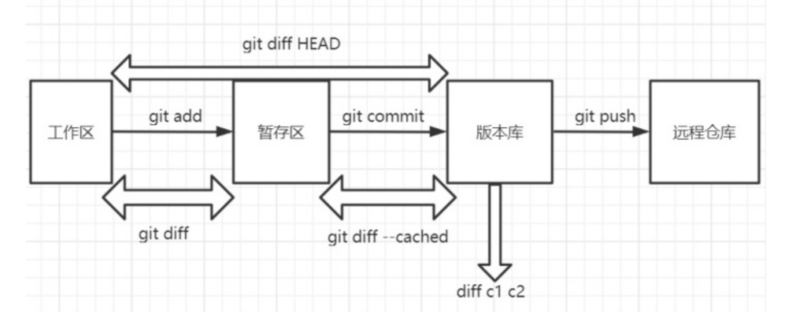
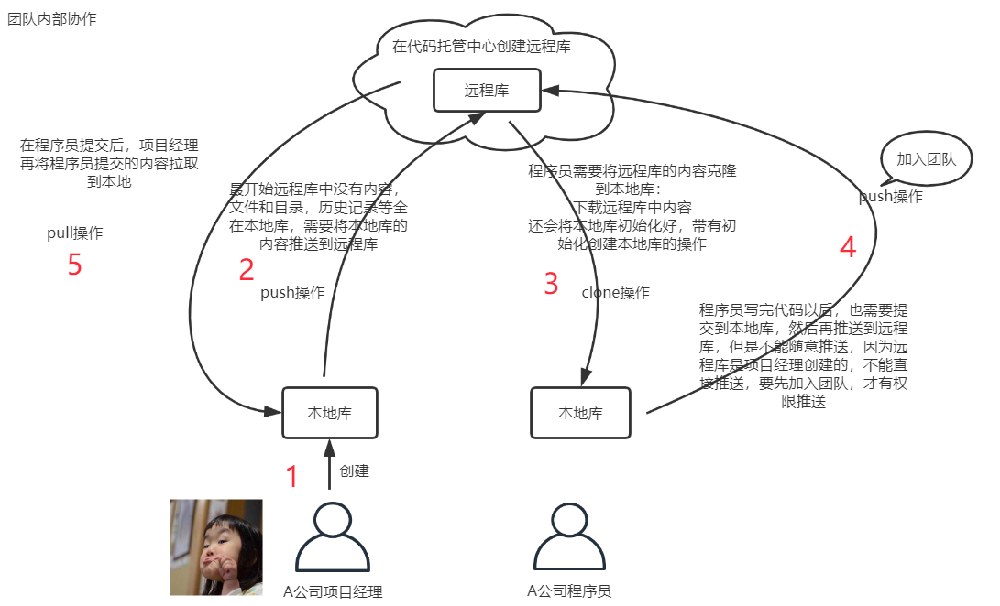
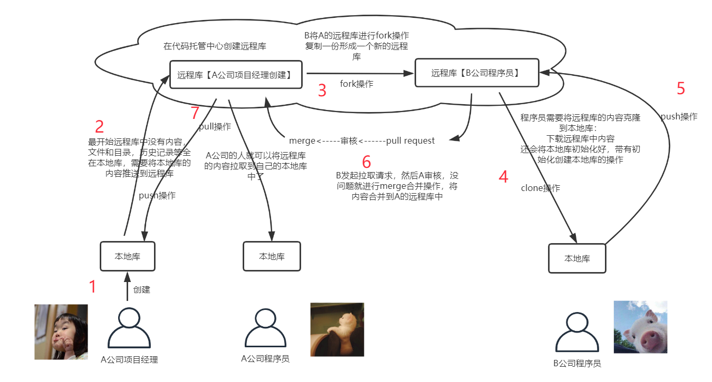

# git基本操作

作者：张金龙

日期：2022-01-17

## 初始化本地仓库

### 创建本地仓库并初始化

```
# 打开git bash
鼠标右键，点击 Git Bash Here

# 查看git版本
git --version

# 清屏
clear

# 设置签名
git config --global user.name "Neo"
git config --globle user.email "13176338080@163.com"

# 创建仓库目录 MyNote
mkdir MyNote

# 本地仓库初始化(.git目录默认隐藏)
git init

# 查看git下内容
ll
```

## git常用命令

### add

```
# 添加文件到暂存区
git add Demo.txt

# 添加多个文件，文件名空格隔开
git add  <文件1> <文件2> <文件3>

# 添加指定目录下及子目录下所有文件，以config目录为例
git add config/*

# 添加指定目录下所有指定类型文件，以home目录下所有.php文件为例
git add home/*.php

# 添加文件夹
git add <文件夹名>

# 批量添加所有文件
git add --all //添加所有文件
```


### commit

```
# 提交文件到本地库
git commit -m "提交备注Message" Demo.txt
** 不放在本地仓库的文件，git不进行管理
** 放到本地仓库的文件， 且通过add和commit命令操作才被管理

# 提交暂存区所有文件至本地库
git commit -m <Message>
```

### status

```
# 查看工作区和暂存区的文件状态
git status
** 红色表示工作区文件修改后未添加至暂存区
** 绿色表示暂存区文件未提交至本地库
```


### log

```
# 日志分页展示
git log
** 显示从最近到最远的日志
** 注意历史记录对应的索引
** 下一页：空格   上一页：b    尾页：END    退出：q

# 日志单行展示
git log --pretty=oneline
** 日志内容显示完整地索引和Message

# 日志简略展示
git log --oneline 
** 日志内容显示部分索引和Message

# 日志按节点展示
git reflog
** 多了HEAD@{数字}，这个数字的含义表示回到这个历史版本需要多少步

```

### reset

```
# 切换至历史版本
git reset --hard [索引]
git reset --hard bc07b79
** 切换至索引为bc07b79这个版本
** 复制：选中即复制    粘贴：右键+paste
```

根据reset后参数的不同，对本地仓库、暂存区和工作区的影响也不同

| 参数         | 说明                                         |
| ------------ | -------------------------------------------- |
| hard（常用） | 本地库指针移动的同时，重置暂存区，重置工作区 |
| mixed        | 本地库指针移动的同时，重置暂存区，工作区不动 |
| soft         | 本地库指针移动的同时，暂存区不动，工作区不动 |

### 删除文件

```
#删除本地仓库的Demo.txt文件
rm Demo.txt
git add Demo.txt
git commit -m "删除文件Demo.txt" Demo.txt
```

### 找回文件

通过reset命令切换至对应的版本即可

### diff

``` 
# 比较工作区和暂存区的文件差异
git diff Demo.txt
** 是当前工作区的文件内容，相比较暂存区（参考）的修改
** git是按行为单位管理数据，同一行差异相当于删除一行（红）后新增一行（绿）

# 比较工作区和指定版本库的文件差异
git diff HEAD [索引] 
git diff HEAD [索引] --README.md

# 比较暂存区和本本库的文件差异
git diff --cached 
git diff --staged
```




### SSH免密登录

优点：不用每次都进行身份验证

缺点：只能针对一个账号

```
# 进入用户主目录
cd ~

# 生成.ssh目录
ssh-keygen -t rsa -C <Github注册邮箱>

**命令中C是大写
**示例ssh-keygen -t rsa -C 13176338080@163.com
**gen -->generation

# 三次回车确认默认值

# 检查.ssh目录下文件
id_rsa
id_rsa.pub

# 添加ssh密钥
1. 打开id_rsa.pub文件，将里面的密钥内容复制
2. 登录GitHub账号，在Setting的SSH and GPG key中添加复制的密钥

# 对SSH远程库起别名
git remote add <远程库的SSH地址>
```


## git场景模拟

在版本控制过程中，使用多分支可同时推进多个任务

好处：

- 多个分支可并行开发，互不影响，提高开发效率
- 如个别分支功能开发失败，直接删除该分支，不会影响其他分支

### 本地库与远程库交互



### 本地仓库初始化

创建一个文件夹后，git是不会管理该文件夹的，需对该文件见初始化，才能在该文件夹内使用git管理其中的文件

```
# 本地仓库初始化
git init
```

### 远程库创建

个人推荐Github来管理远程库，Gitee虽然本地访问速度快，但是在是看不上这个产品

```
# 在GitHub中创建仓库
1. 点击New repository
2. 在”Repository name"填入仓库名称
3. 仓库默认为Pubic，可选择Private（不公开）
4. 点击“Create repository”，
```

### 本地创建远程库地址别名

远程库地址分为HTTPS和SSH地址

远程库地址比较长，每次复制比较麻烦，可通过设置远程库别名来方便记载

```
# 查看远程库别名
git remote [-V] 

# 远程库起别名
git remote add <别名>  <远程库地址>

# 远程库重命名
git remote rename <oldName> <newName>

# 远程库别名移除
git remote remove <name>
```


### 分支管理

```
# 创建本地分支
git branch <分支名称>

# 切换分支
git checkout <branchname>

# 查看本地库分支
git branch

# 查看远程库分支
git branch -r

# 从当前分支创建新分支
git checkout -b <新分支名称>

# 提交新分支到远程库
git push --set-upstream origin dev //dev为创建分支的名字

# 强制提交本地分支覆盖远程库分支
git push --force origin <分支名>
```


### 推送操作

将本地库推送至远程库

```
# 常规操作
git push <远程库别名或地址> <本地分支名>:<远程分支名>

# 本地分支名与远程分支名相同
git push <远程库>  <本地分支名>

# 本地与远程库版本有差异，强制推送
git push --force <远程库> <分支名>

# 删除远程库分支
git push <远程库> --delete <分支名>
```


### 克隆操作

克隆操作可以帮助我们完成：

1. 初始化本地仓库
2. 将远程库的内容完整地拷贝到本地仓库
3. 替我们建立远程库的别名（默认origin）

```
# 克隆远程库至本地
git clone <远程库地址>
```


### 邀请团队成员

```
# 以GitHub为例
1. 登录GitHub账号
2. 进入相应的仓库
3. 在Setting里Collaborator，点击add people
4. 输入想要邀请成员的GitHub昵称或邮箱，搜索到成员
5. 复制邀请链接，发送至想邀请的成员即可
```

### 远程库修改后拉取

如果远程库的内容已被修改，此时想将远程库内容同步至本地库，可进行如下操作

```
# 确认远程库内容已更新（非必须）
登录至GitHub，检查确认对应仓库的文件已更新

# 抓取远程库至本地
git fetch <远程库地址> <分支名称>  //示例git fetch origin main
**fetch 只是将远程库的内容下载至本地，但工作区的文件并没有更新，工作区还是原先的内容

# 切换至抓取下来的远程库内容是否正确
git checkout origin/main
ll

# 合并前将分支切换回要合并的分支
git checkout main

# 进行分支合并（远程库合并到本地库）
git merge origin/main

```

远程库拉取可直接使用pull命令来操作，但为了保险起见，慎用

fetch+merge   可靠

pull					省事

```
# 直接拉去远程仓库并合并至本地分支
git pull <远程库地址> <分支名称>
```

### 冲突解决

冲突的产生：

同一个分支下，以某一个版本为参考，本地库和远程库针对同一个文件的同一个位置做了不同的修改，此时将本地库推送至远程库会产生冲突

解决办法：

先将远程库拉取下来，然后修改冲突，再推送到远程库

```
# 先拉取远程库至本地
git pull origin main

# 根据提示查看冲突
打开文档在冲突位置会有提示，该删的删，该留的留

# 冲突解决完成
git add Test.txt
git commit -m "解决了Test.txt的冲突问题"   //解决冲突时，提交不可以带文件名，否则提交失败

# 推送至远程库
git push origin main //解决了冲突问题
```

### 跨团队交互



```
# 得到远程库地址
访问远程库，然后fork一下

# clone到本地进行修改
git clone <远程库地址>

# 修改本地数据，提交到本地库
git add Test2.txt
git commit -m "创建了Test2.txt" Test2.txt

# 推送到远程库
git push <远程库地址> <远程库分支>

# 进行pull request

# 进行审核
可相互留言
可查看File changed

# 确认通过后，可合并
confirm merge
```

## IDEA集成git

### git配置

```
# 配置git
在Setting的Version controlli的git里配置git安装路径\\Git\bin\git.ext

# 本地库的初始化
VSC 的import into Version control的Create Git Repsitory

# git操作
右键的git中包含git的常用操作

```

### 本地库与远程库交互

```
# git允许不相关历史合并
git pull origin main --allow-unrelated-histories
**解决两个仓库有不同的开始点，也就是两个仓库没有共同的commit出现的无法提交

# 推送操作
git push -u origin main -f
**如仍无法提交，请检查是否存在冲突，解决冲突后再提交
```

一般在开发中，先pull再push，不会直接进行push操作


## 如何避免冲突

1. 团队开发中，避免在一个文件中改代码
2. 在修改一个文件前，在push之前，先pull操作
